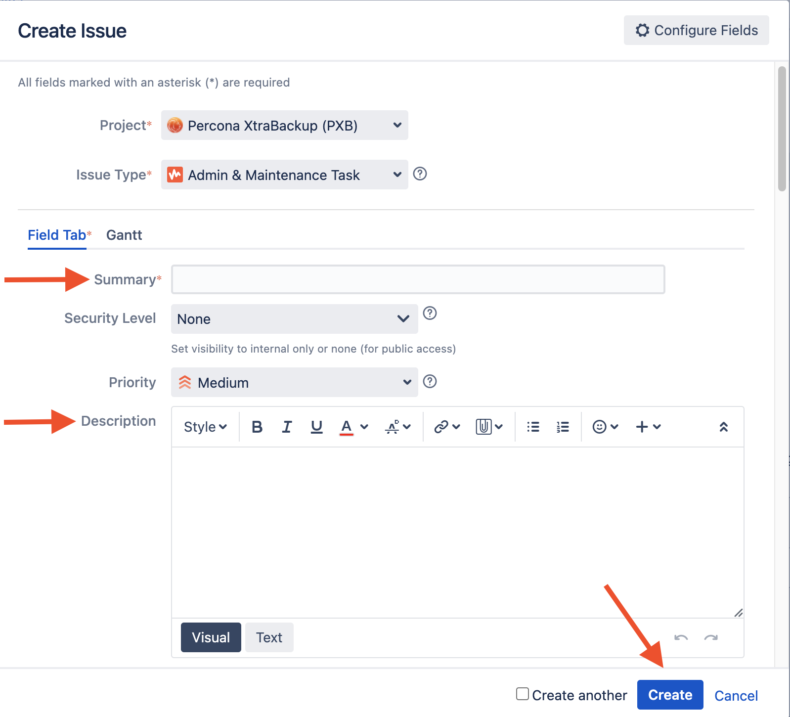
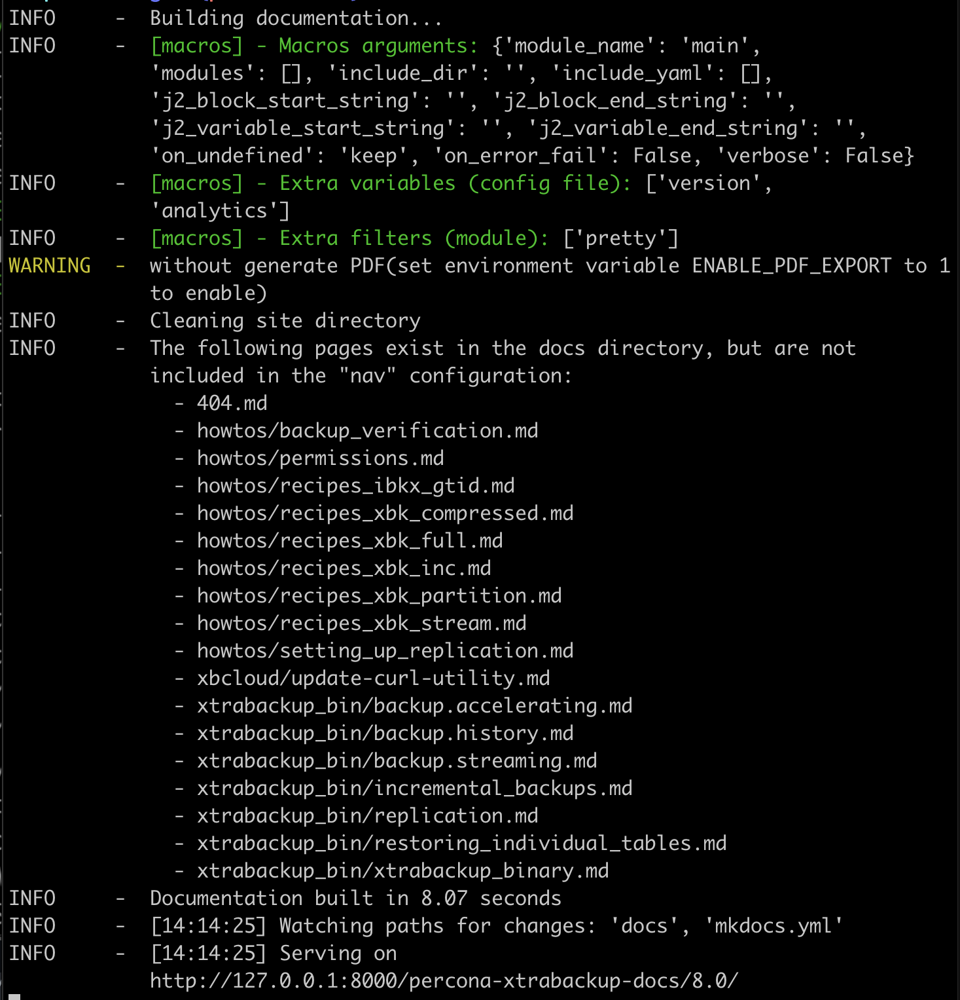

# Documentation contributing guide

We welcome contributions from all users and the community. By contributing, you agree to the [Percona Community code of conduct](https://percona.community/contribute/coc/). Thank you for deciding to contribute and help us improve the [Percona XtraBackup documentation](https://docs.percona.com/percona-xtrabackup/).

You can contribute to the documentation in either of the following ways:

- [Documentation contributing guide](#documentation-contributing-guide)
  - [Add a forum topic](#add-a-forum-topic)
  - [Request a change with a Jira issue](#request-a-change-with-a-jira-issue)
  - [Contribute to the documentation yourself](#contribute-to-documentation-yourself)
    - [What you should know](#what-you-should-know)
    - [What happens after you create the pull request](#what-happens-after-you-create-the-pull-request)
    - [Edit documentation online with GitHub](#edit-documentation-online-with-github)
    - [Edit documentation locally](#edit-documentation-locally)
    - [Building the documentation](#building-the-documentation)

## Add a forum topic

In the [Percona Product Documentation category](https://forums.percona.com/c/percona-product-documentation/71) in the Percona Community Forum, select **New Topic**. Complete the form and select **Create Topic** to add the topic to the forum.


## Request a change with a Jira issue

If you would rather not [contribute to the documentation yourself](#contribute-to-documentation-yourself), let us know about the issue by adding a Jira ticket. Use the following procedure to create a Jira ticket:

In the Contact Us section, select the link in "open a JIRA ticket" 


- In the `Contact Us` section, located at the bottom of the page, select the **open a JIRA ticket** link. This action opens the [Jira issue tracker](https://jira.percona.com/projects/PXB/issues) for the doc project.

- Log in (create a Jira account if you don't have one) and select **Create** to open the Jira form.



- In the following fields, describe the issue:
    - In the Summary, provide a brief description of the issue.
    - In the Description, provide more information about the issue. If needed, add a Steps To Reproduce section and information about your environment (version number, your operating system, etc.). Be detailed. 
    - In the Affects Version/s field, enter the version number(s). It is OK to add the version number with an ".x" (such as ``8.0.x``) if you don't know the exact version that must be updated.
    - Select **CREATE** to create the ticket.

## Contribute to documentation yourself

Use either the [Edit documentation online with GitHub](#edit-documentation-online-with-github) method or the [Edit documentation locally](#edit-documentation-locally) method to make changes to the documentation and create a pull request. 

### What you should know

Most of the document is in plain text, but you may use [Markdown](https://www.markdownguide.org/) to add syntax elements (notes, tables, and so on) to the documentation. 

There are several active versions of the documentation. Each version has a branch in the repository named accordingly:

- 2.4
- 8.0
- inno-release

The `.md` files are in the ``docs/`` directory.

### What happens after you create the pull request

A core developer reviews your request and either comments or approves the request. A core developer merges the approved request to the **main** branch usually when a newer version of the product is released.

!!! note

    We appreciate your work but the pull request may be redone to meet internal requirements.

### Edit documentation online with GitHub

Next to the page title, select the pencil icon to open the source file in the GitHub editor. In this editor, you can make the changes, view the changes in the Preview tab, and create a pull request. The source `.md` file of the page opens in a GitHub editor in your browser. If you haven't worked with the repository before, GitHub creates a [fork](https://docs.github.com/en/github/getting-started-with-github/fork-a-repo).

Edit the page using the [Markdown](https://www.markdownguide.org/) syntax.

You should review your changes on the **Preview** tab.

Commit your changes to a pull request.

In the **Commit changes** section, add a summary (72 characters or less) of what was changed.
  
Then select the **Create a new branch for this commit and start a pull request** option. Accept the name for the branch and then Select **Commit changes**.

GitHub creates a branch and a commit for your changes. The operation loads a page that shows the following:

- a base branch where you offer your changes
  
- your commit message
  
- a visual representation of your changes against the original page 

Review the information and click **Create pull request**.

For more information, see [Editing files in GitHub](https://docs.github.com/en/repositories/working-with-files/managing-files/editing-files) 

### Edit documentation locally

This option is for users who are comfortable with [git](https://git-scm.com/) commands. 

The steps are the following:

1. Fork this repository.

2. Clone the forked repository to your machine:

    ```shell
    git clone git@github.com:<your_github_name>/pxb-docs.git
    cd <directory name>/pxb-docs
    ```

3. Add the remote origin repository:

    ```shell
    git remote add origin https://github.com/percona/pxb-docs.git
    ```

4. Checkout the appropriate branch and pull the latest changes from origin:

    ```shell
    git checkout 8.0 && git pull origin 8.0
    ```

5. Create a separate branch for your changes:

    ```shell
    git checkout -b <my_changes>
    ```

6. Work in the `/docs` directory. Add code examples, if necessary. We recommend that you check your changes using either a Preview built into your editor (if you have one) or [build HTML on your machine](#building-the-documentation).

7. Add the changed file:

    ```shell
    git add <changed file>
    ```

8. Commit your changes:

    ```shell
    git commit -m 'Fixed typing error in <document name>'
    ```

9. Open a pull request to Percona:

    ```shell
    git push <my repo> <my_changes>
    ```

### Building the documentation

To verify your changes, you can use a MkDocs command to build HTML.

Follow the [MkDocs Installation](https://www.mkdocs.org/user-guide/installation/) instructions.

After the installation, in the root directory, run the following command to build the documentation:

```shell
mkdocs serve
```

The output is the following:



Open a browser and navigate to `http://127.0.0.1:8000/percona-xtrabackup/8.0/` or `http://127.0.0.1:8000/percona-xtrabackup/2.4/` to see the HTML files. You may need to navigate to the document that you have changed.