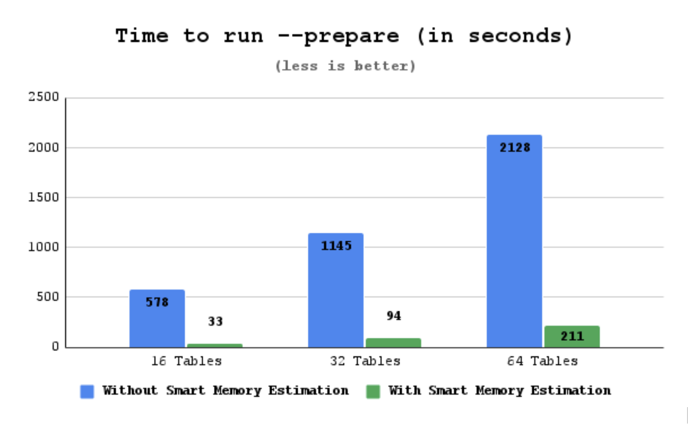

# Smart memory estimation

The `Smart memory estimation` is [tech preview](../glossary.md#tech-preview) feature. Before using `Smart memory estimation` in production, we recommend that you test restoring production from physical backups in your environment, and also use the alternative backup method for redundancy.

[Percona XtraBackup 8.0.30-23](../release-notes/8.0/8.0.30-23.0.md) adds support for `Smart memory estimation` feature to compute the memory required to `--prepare` a backup. 

Percona XtraBackup performs the backup procedure in two steps: 

* Creates a backup

    To create a backup, Percona XtraBackup copies your *InnoDB* data files. While copying the files, Percona XtraBackup runs a background process that watches the InnoDB redo log, also called the transaction log, and copies changes from it. 

* Prepares a backup

    During the `prepare` phase, Percona XtraBackup performs crash recovery against the copied data files using the copied transaction log file. Percona XtraBackup reads all the redo log entries into memory, categorizes them by space id and page id, reads the relevant pages into memory, and checks the log sequence number (LSN) on the page and on the redo log record. If the LSN in the redo log is more recent than on the page, Percona Xtrabackup applies the redo log changes to the page.

    To `prepare` a backup, Percona Xtrabackup uses InnoDB Buffer Pool memory. Memory for 256 pages is reserved for loading the pages into the buffer pool, while the remaining memory is used for hashing/categorizing the redo log entries. 

    The available memory is controlled by the `--use-memory` option. If the available memory on the buffer pool is insufficient, the work is performed in multiple batches. After the batch is processed, the memory is freed to release space for the next batch. This process greatly impacts performance as an InnoDB page holds data from multiple rows. If a change on a page happens in different batches, that page is fetched and evicted numerous times.

## How does `Smart memory estimation` work

Starting with [Percona XtraBackup 8.0.30-23](../release-notes/8.0/8.0.30-23.0.md), while copying redo log entries during the backup phase, Percona XtraBackup computes the memory required for `prepare` phase. Percona XtraBackup also takes into consideration the number of InnoDB pages to be fetched from the disk. Then Percona XtraBackup checks the server's available free memory and uses that memory up to the limit specified in the `--use-free-memory-pct` option to run `--prepare`. The default value of `--use-free-memory-pct` option is 0. This means that the option is disabled by default. If, for example, you set the option to 50, 50% of the free memory is used to `prepare` a backup. The maximum allowed value is 100.

## Exapmple of `Smart memory estimation` usage

Here is an example of how `Smart memory estimation` can improve the time spent on `prepare`.

Let's say we run 3 backups, using sysbench with 16, 32, and 64 tables containing 1M rows each. The `--use-free-memory-pct` option is set to 50. This means that 50% of the free memory is used to `prepare` a backup. The backup is run on an ec2 c4.8xlarge instance (36 vCPU's / 60G memory / General Purpose SSD (gp2)). 

During each `--backup` the following sysbench is run:

  sysbench --db-driver=mysql --db-ps-mode=disable --mysql-user=sysbench --mysql-password=sysbench --table_size=1000000 --tables=${NUM_OF_TABLES} --threads=24 --time=0 --report-interval=1 /usr/share/sysbench/oltp_write_only.lua run

The following table shows the backup details:

||Used memory (G)|Size of Xtrabackup log (G)|Size of backup (G)|
|---|---|---|---|
| 16 tables | 3.375 | 0.7 | 4.7 |
| 32 tables | 8.625 | 2.6 | 11 |
| 64 tables | 18.5 | 5.6 | 22 |

* **Used memory (G)** - the amount of memory required by Percona XtraBackup with `--use-free-memory-pct=50`

* **Size of Xtrabackup log (G)** - the size of Percona XtraBackup log file (redo log entries copied during the backup)

* **Size of backup (G)** - the size of the resulting backup folder

`Prepare` executed without `Smart Memory Estimation` use the default of 128M for the buffer pool.

The results are the following:

!!! note

    The following results are based on tests in a specific environment. Your results may vary.

* **16 tables result** - prepare time dropped to ~5.7% of the original time. An improvement in recovery time of about 17X.

* **32 tables result** - prepare time dropped to ~8,2% of the original time. An improvement in recovery time of about 12x.

* **64 tables result** - prepare time dropped to ~9.9% of the original time. An improvement in recovery time of about 10x.
