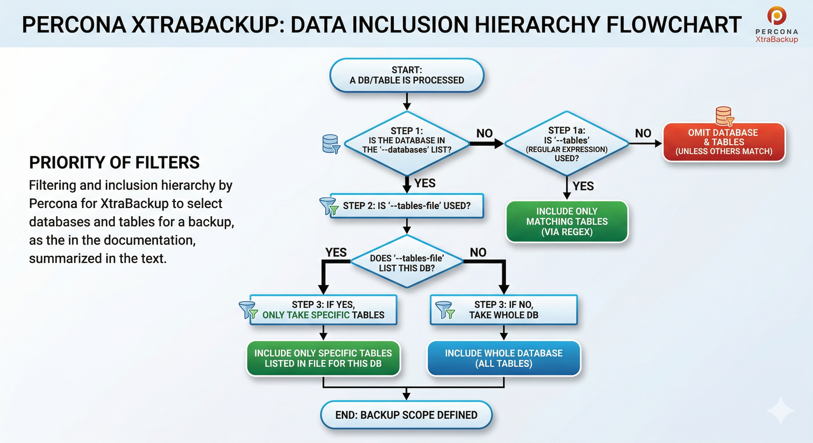
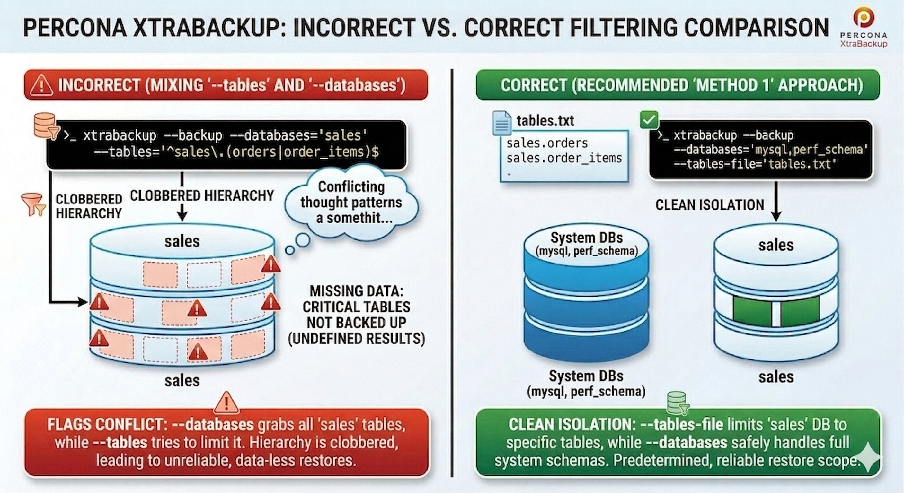
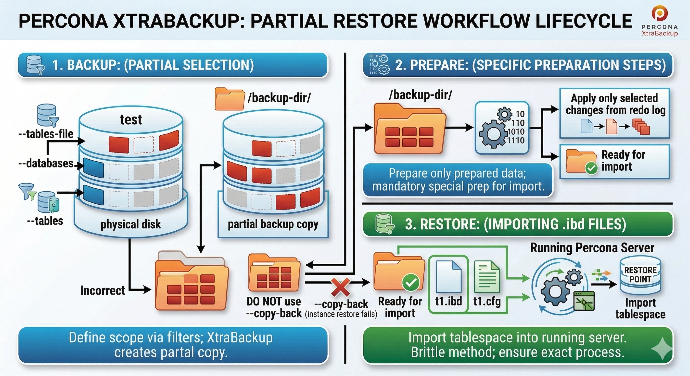

# Create a partial backup

With `innodb_file_per_table` enabled, *xtrabackup* can take partial backups. Pick a selection method:

* Match table names with a regular expression

* List table names in a file

* List databases (or tables) explicitly

!!! note "Partial backup workflow"

    **`--copy-back` is for a full prepared backup** that can replace the whole datadir as one consistent tree. A partial backup omits tablespaces on purpose, while InnoDB’s data dictionary can still describe objects that are not present in the backup directory—so treating that tree like a full instance with `--copy-back` commonly produces missing-tablespace warnings, orphaned dictionary entries, or a server that needs hand repair.

    **Prefer restoring only the tables you backed up** using the flows in [Restore a partial backup](restore-partial-backup.md) and [Restore single tables](restore-individual-tables.md) (typically create the table DDL, then `DISCARD TABLESPACE` / copy `.ibd` / `IMPORT TABLESPACE`). The partial-restore guide also documents a copy-back-to-empty-datadir variant with extra cleanup; use it only when you accept that operational cost. Do not start an incremental backup chain on top of a partial backup.

    If a matched or listed table is dropped while the backup runs, *xtrabackup* fails: the backup must still copy that table’s files, and a concurrent `DROP TABLE` (or drop of its database) can remove the `.ibd` before the copy step. That is different from a **new** table created mid-run in a database already in scope, which may still be included. For heavy concurrent DDL, consider options such as [`--lock-ddl`](faq.md#how-to-deal-with-skipping-of-redo-logs-for-ddl-operations) (see the FAQ).

This page assumes a `test` database with tables `t1` and `t2`.

Narrow the backup scope with:

* `--tables` — table names on the command line

* `--tables-file` — table names, one per line in a file

* `--databases` — databases or specific tables on the command line

* `--databases-file` — databases or specific tables, one per line in a file

!!! note "Do not use `--tables` and `--databases` together"

    Combining them yields unreliable backups: restores may skip tables you needed or leave out data you thought you had captured.

    They rely on different filters and clash when mixed:

    * `--tables` uses regular expressions and implies a partial backup.
    * `--databases` uses exact names and implies a full backup of listed databases.

    For example, a database named in `--databases` is fully backed up even if `--tables` was meant to limit it; expected tables can vanish from the archive. To mix full databases with hand-picked tables, pair `--tables-file` with `--databases` (see [Filtering behavior with examples](#filtering-behavior-with-examples)).

## The `--tables` option

Pass `--tables` to *xtrabackup* with either:

* A comma-separated list of fully qualified names: `database.table` (for example, `db1.t1,db1.t2,db2.t3`)

* A POSIX regular expression in single quotes that matches the full `databasename.tablename` string

Back up every table in `test`:

```shell
xtrabackup --backup --datadir=/var/lib/mysql --target-dir=/data/backups/ \
--tables='^test[.].*'
```

Back up only `test.t1`:

```shell
xtrabackup --backup --datadir=/var/lib/mysql --target-dir=/data/backups/ \
--tables='^test[.]t1'
```

## The `--tables-file` option

`--tables-file` points to a file with one `database.table` per line. XtraBackup includes only those tables, matching names exactly (case-sensitive), with no patterns or regex. Use fully qualified names.

```shell
echo "mydatabase.mytable" > /tmp/tables.txt
xtrabackup --backup --tables-file=/tmp/tables.txt
```

## The `--databases` and `--databases-file` options

Both options pick databases or tables to include and share the same filter rules; only the input format differs:

| | `--databases` | `--databases-file` |
|---|---|---|
| Where | Comma-separated on the command line | Path to a file, one database or `database.table` per line |
| Format | `mysql,mydb,mydb.t1,mydb.t2` | Same `databasename` or `databasename.tablename` format, one per line |
| Use when | Short, one-off runs | Long lists or scripted reuse |

`--databases` takes a comma-separated list. Append `.*` after a database name to grab every table in it (for example, `mydb.*`). Regex elsewhere is not supported.

Include `mysql`, `sys`, and `performance_schema` whenever you list databases with `--databases` or `--databases-file`, even if you only care about application data. A partial backup that is meant to become a **runnable datadir** (after [prepare](prepare-partial-backup.md) and especially after [`--copy-back`](restore-a-backup.md)) must still contain the **system catalogs** MySQL Server expects on disk.

* **`mysql`** — Accounts, privileges, and MySQL 8.0 system tables (including metadata InnoDB uses). If this schema is missing from the backup, **`mysqld` usually fails to start** after you copy the tree into place, or the instance comes up without a working login or privilege layer.
* **`performance_schema`** — Default instrumentation tables and structures; omitting it commonly causes **startup errors** or a failed upgrade/bootstrap of internal state.
* **`sys`** — Helper views built on `performance_schema`; omitting it breaks tools and scripts that assume it exists.

The failure shows up at **restore time—typically the first server start** after [`--copy-back`](restore-a-backup.md) (or an equivalent full-datadir deployment), not during `xtrabackup --backup`. **`xtrabackup --prepare`** may still run, but you discover the gap when the server refuses to start or is unusable.

If you **never** replace a whole datadir—only [import](restore-individual-tables.md) selected tables into an **existing** server that already has its own `mysql` / `sys` / `performance_schema`—you might not need those schemas in *this* partial backup; the flows above assume you may rely on a full-datadir restore path.

!!! note
   
    Backups take time. If someone creates a table while the run is in progress, XtraBackup may still copy it even though you never listed it, provided (1) its database already sits inside your filter and (2) the table exists when that database is processed.

```shell
xtrabackup --backup --databases='mysql,sys,performance_schema,test' --target-dir=/data/backups/
```

## Filtering behavior with examples

Never mix `--tables` and `--databases` in one invocation. XtraBackup applies `--databases` first; that pass can override your `--tables` regex, so you may omit critical tables or pull in extras—both invite data loss on restore.

### How filtering works

To see why those flags clash, follow the evaluation order: database filter first, then table filter.



#### Database check (`--databases`)

XtraBackup decides inclusion or exclusion at the database level.

* With `--databases`, any database absent from the list is skipped outright.
* A database on the list normally brings in every table—unless you also pass `--tables-file`. Then, for databases named in both places, only the tables listed in the file are copied.

Example pairing `--tables-file` with full system databases: to capture all of `mysql`, `performance_schema`, and `sys`, plus only `testdb.table1` and `testdb.table2`, put the two table lines in a file. List the three system databases in `--databases`; omit `testdb` there.

```shell
echo -e "testdb.table1\ntestdb.table2" > tables.txt
xtrabackup --backup --databases="mysql,performance_schema,sys" --tables-file=tables.txt --target-dir=/data/backups/
```

The database stage pulls in `mysql`, `performance_schema`, and `sys`. The table stage adds `testdb.table1` and `testdb.table2`. Outcome: full dumps of the three system databases; from `testdb`, only those two tables.

#### Table check (`--tables` / `--tables-file`)

For each database that cleared the first stage, XtraBackup chooses tables via `--tables` or `--tables-file`:

* `--tables`: Supply a comma-separated `database.table` list or one POSIX regex. Only names that match are copied.

* `--tables-file`: Supply a path to a file with one exact `database.table` per line (no regex). Any database named in this file is limited to those tables—even if `--databases` also lists that database.

With both `--databases` and `--tables-file`: listed databases are eligible, but for any database also named in the file, only the tables in the file are copied. With `--databases` alone: every table in each listed database is copied.

### Solution: combine specific tables and whole databases

To back up hand-picked tables in one schema (say `testdb.table1`, `testdb.table2`) while taking full dumps of others (`mysql`, `performance_schema`, `sys`), use one of the methods below—never `--tables` plus `--databases` for that job:



* Case 1: `xtrabackup --backup --tables="testdb.table1" --databases="mysql"` — `testdb` never enters the database filter, so nothing from `testdb` arrives.
* Case 2: `xtrabackup --backup --tables="testdb.table1" --databases="mysql,testdb"` — `testdb` is fully included; XtraBackup copies every table there and ignores the `--tables` regex.

Preferred approaches:

Method 1: `--tables-file` (recommended)

List the exact tables, one per line:

```text
testdb.table1
testdb.table2
```

Run XtraBackup with `--tables-file` and `--databases`. Omit the database that owns the partial list from `--databases`; the file carries that scope. Name only the databases you want in full (typically the system schemas):

```shell
xtrabackup --backup --tables-file=tables.txt --databases="mysql,performance_schema,sys" --target-dir=/data/backups/
```

Here `--tables-file` limits `testdb` to the listed tables while `--databases` covers the system databases completely.

!!! note "Avoid duplication"
    When `--tables-file` names tables from a database (for example, `testdb`), do not repeat `testdb` in `--databases`. Doing so flips the job to a full database backup.

Method 2: `--databases` for everything

List specific tables in `--databases` using `database.table`. That copies the system schemas in full and only the listed tables from `testdb`:

```shell
xtrabackup --backup --databases="mysql,performance_schema,sys,testdb.table1,testdb.table2" --target-dir=/data/backups/
```

For an entire single database, suffix the name with `.*` (for example, `mydb.*`). See the [databases](xtrabackup-option-reference.md#databases) option reference.

### Example: mixing flags with a `sales` schema

Suppose a `sales` database holds `orders` and `order_items` and you want only those two tables, plus a full copy of `mysql`. Mixing `--tables` and `--databases` might look like this:

```shell
xtrabackup --backup --databases='mysql,sales' --tables='^sales\.(orders|order_items)$' --target-dir=/data/backups/
```

Do not rely on that command: you are not guaranteed only `sales.orders` and `sales.order_items`. The backup might hold just those two tables, or it might include every table in `sales` plus all of `mysql`, or something inconsistent in between.

**Preferred:** list only `mysql` under `--databases` and name the two tables in `--tables-file`:

```shell
echo -e "sales.orders\nsales.order_items" > sales_tables.txt
xtrabackup --backup --databases='mysql' --tables-file=sales_tables.txt --target-dir=/data/backups/
```

**Or** pass the tables on the `--databases` line (no `--tables`):

```shell
xtrabackup --backup --databases='mysql,sales.orders,sales.order_items' --target-dir=/data/backups/
```

## The `--databases-file` option

`--databases-file` points to a file of databases and tables in `databasename[.tablename]` form, one entry per line. Names match exactly (case-sensitive); patterns and regex are not applied.

!!! note
   
    Backups take time. If a table appears mid-run, XtraBackup may still copy it though you never listed it, when (1) its database already lies inside your filter and (2) the table exists when that database is processed.

## After the backup



Next, [prepare](prepare-partial-backup.md) the backup before you restore.
