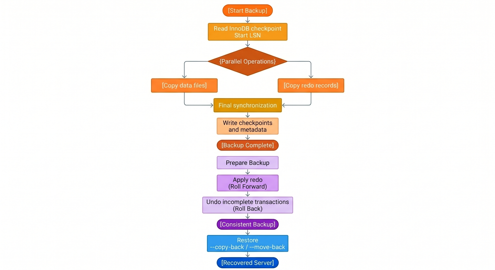

# Percona XtraBackup internals

Percona XtraBackup (PXB) runs three sequential phases: backup, prepare, and restore. Hot physical backup depends on log sequence numbers (LSNs), redo capture, prepare recovery, and locking.

Commands, operational tuning, and step-by-step procedures appear in separate documents. For tasks and flags, see [How to run a backup lifecycle](how-xtrabackup-works-how-to.md). For privileges, defaults, and quick tables, see [Backup lifecycle reference](how-xtrabackup-works-reference.md).

## What work does each phase perform?

The following table maps each operator phase to the InnoDB-internal work in that phase:

| Phase | Internal work |
|-------|---------------|
| Backup (hot copy) | Copy data files and capture redo for the full backup window |
| Prepare | Replay captured redo, then roll back transactions open at backup end |
| Restore | Place the prepared files in the destination `datadir` |

Prepare uses the same pipeline as InnoDB crash recovery. Prepare runs offline on the backup tree.

## How do data copy and redo capture interact?

PXB copies files and redo in parallel during the backup phase. Prepare runs later on the backup directory while the server stays offline.

The following table maps the timeline to operator-visible work:

| Stage | Server state | PXB internal work |
|-------|--------------|-------------------|
| Backup start | Online | Record checkpoint LSN. Start data copy and redo thread. |
| Backup window | Online | Copy redo while pages copy at mixed LSNs. |
| Final sync | Online | Pin sync point. Stop redo thread. Write checkpoints. |
| Prepare | Offline | Apply redo, then undo, on the backup tree. |
| Restore | Target `datadir` offline | Copy prepared files into server paths. |

For backup artifacts, see [Index of files created by Percona XtraBackup](xtrabackup-files.md) and [XtraBackup backup files](generated-files.md).

## What happens during the backup phase?

The backup phase produces a directory with everything `mysqld` needs to start a server. The output includes data files for every storage engine, a captured slice of the InnoDB redo log, and metadata files.

PXB reads the latest InnoDB redo checkpoint to record a start LSN. PXB then runs two parallel streams of work:

* A data-file stream copies on-disk files for every storage engine in use. InnoDB tablespaces (`.ibd` files), the shared tablespace (`ibdata1`), and undo tablespaces make up most of the volume. PXB also copies files for MyISAM, CSV, MyRocks, and other recognized engines.

* A background redo-log thread copies the InnoDB redo log from that checkpoint LSN through the end of the backup window. The thread writes the capture into `xtrabackup_logfile` in the backup directory.

During final sync, PXB runs `FLUSH NO_WRITE_TO_BINLOG BINARY LOGS`. PXB queries `performance_schema.log_status`. When backup locks are in use, final sync runs before locks are released. The query records the checkpoint LSN, the current LSN, binary log file and position, and replica coordinates. The redo thread copies redo through the current LSN, then stops. PXB records both values in `xtrabackup_checkpoints`. The `to_lsn` field holds the checkpoint LSN from the sync point. The `last_lsn` field holds the current LSN where the redo thread stopped.

MyRocks copies are always full copies. The MyRocks storage layout has no per-page change tracking. PXB copies every MyRocks file on each backup, including incremental backups. Plan backup storage and network capacity as repeated full RocksDB copies, not as InnoDB-style incrementals. On mixed-engine servers, InnoDB incrementals can still save space while MyRocks data is re-copied every run. For details, see [About Percona XtraBackup](about-xtrabackup.md) and [Create an incremental backup](create-incremental-backup.md).

Dual capture lets prepare advance the copy to a single LSN. PXB also writes metadata files for prepare and restore. Files include `xtrabackup_checkpoints`, `xtrabackup_info`, `xtrabackup_binlog_info`, and `backup-my.cnf`.

Two flags shape locking and redo retention during the backup:

| Flag | Default | Effect |
|------|---------|--------|
| `--lock-ddl` | `ON` | Controls when the backup lock takes effect |
| `--register-redo-log-consumer` | `OFF` | Retains redo files on the server until PXB finishes reading them |

### Why is the backup copy not yet consistent?

InnoDB keeps writing while PXB reads files. Copied pages reflect mixed points in time. Pages copied early carry older LSNs than pages copied later.

PXB records the redo checkpoint LSN at backup start. PXB copies InnoDB data files. A background thread copies the InnoDB redo log in parallel for the entire backup window.

The redo capture matters for two reasons:

* The `.ibd` page reads span real clock time. Without a continuous redo log, prepare cannot advance the copy to a single LSN.

* InnoDB redo files wrap and recycle. The redo thread must read every record before the server overwrites the underlying file.

Without redo capture, the directory holds physically mixed page images. The copy cannot run InnoDB recovery against a single LSN. The dataset becomes consistent during prepare, not during the file copy.

### What lock postures does PXB use during backup?

PXB stages locking so InnoDB data manipulation language (DML) keeps running through the bulk file copy. The lock posture during the InnoDB copy depends on `--lock-ddl`. Final sync always runs under the backup lock when locks are in use.

With `--lock-ddl=ON` (default), PXB takes `LOCK INSTANCE FOR BACKUP` or `LOCK TABLES FOR BACKUP` before copying InnoDB files. Data definition language (DDL) stays blocked for the full run.

| # | Lock posture | Internal work |
|---|--------------|---------------|
| 1 | Backup lock | Copy InnoDB data files and copy redo while DML continues |
| 2 | Backup lock | Copy non-InnoDB files such as `.MRG`, `.MYD`, `.MYI`, `.CSM`, `.CSV`, `.sdi`, and `.par` |
| 3 | Backup lock (short) | Run `FLUSH NO_WRITE_TO_BINLOG BINARY LOGS`, read `performance_schema.log_status`, stop the redo thread, then release locks |

With `--lock-ddl=REDUCED`, PXB copies InnoDB files before taking the backup lock. DDL can run during the InnoDB phase. PXB tracks tablespace changes from redo and recopies affected files after the lock is taken.

| # | Lock posture | Internal work |
|---|--------------|---------------|
| 1 | No backup lock | Copy InnoDB data files and copy redo while DML continues |
| 2 | Backup lock | Copy non-InnoDB files. Recopy tablespaces changed by concurrent DDL. |
| 3 | Backup lock (short) | Run `FLUSH NO_WRITE_TO_BINLOG BINARY LOGS`, read `performance_schema.log_status`, stop the redo thread, then release locks |

For lock primitives, see [Reduced backup lock time](reduction-in-locks.md) and the MySQL documentation for [`LOCK INSTANCE FOR BACKUP`](https://dev.mysql.com/doc/refman/{{vers}}/en/lock-instance-for-backup.html).

### Why does PXB prefer backup locks over FTWRL?

Backup locks block DDL but allow InnoDB DML to continue. PXB uses redo capture and prepare for InnoDB consistency. PXB does not freeze InnoDB writes during the copy.

`FLUSH TABLES WITH READ LOCK` (FTWRL) closes all open tables and blocks writes broadly. FTWRL waits for long-running queries before the lock can succeed.

PXB uses backup locks when the server supports them and non-InnoDB tables need protection. PXB falls back to FTWRL when backup locks are unavailable. PXB can require FTWRL when `--slave-info` needs relay coordinates that stock MySQL does not expose through `log_status`.

For FTWRL behavior and wait options, see [FLUSH TABLES WITH READ LOCK option](flush-tables-with-read-lock.md).

### How do `--lock-ddl=ON` and `--lock-ddl=REDUCED` compare?

The `--lock-ddl` flag controls when PXB takes the backup lock that blocks DDL.

The following table compares the two modes:

| Value | Backup lock taken | DDL impact |
|-------|-------------------|------------|
| `ON` (default) | Backup start | DDL is restricted for the full backup window |
| `REDUCED` | After the InnoDB copy finishes | DDL is restricted for a shorter window. DDL runs concurrently with the InnoDB copy. PXB tracks tablespace changes from redo and recopies affected tablespaces when the lock is taken. |

InnoDB DML continues through the main copy under both modes.

### How does `--register-redo-log-consumer` retain redo?

On a high-traffic host, the server can recycle redo files before PXB finishes reading them. A purged redo file makes the backup unusable.

The `--register-redo-log-consumer` flag registers PXB as a redo consumer. The server retains a redo file until PXB has copied that file.

Review the following trade-offs before you enable the flag:

* Redo files stay on disk longer. Peak redo size rises during the run.

* Free space can drop sharply on a long backup of a write-heavy server.

* The server can pause writes briefly when the consumer advances.

!!! warning

    Monitor free disk during the backup. Abort with Ctrl+C or `SIGTERM` to `xtrabackup` if disk space reaches a critical threshold. The consumer releases on abort. The server can then purge redo.

The default value is `OFF`. Enable the flag only when spare disk space is available.

### When does PXB skip backup locks?

PXB skips backup locks only when every table in every schema uses InnoDB. The check includes the `mysql` system schema. Most installations still hold CSV or MyISAM tables in `mysql`, such as `general_log`. PXB takes backup locks in practice.

Replication coordinate handling depends on the server build:

* Percona Server for MySQL can fold relay coordinates into `log_status`. The fold reduces the locks needed for `--slave-info`.

* Stock MySQL can require `FLUSH TABLES WITH READ LOCK` for some relay-position scenarios.

### How do incremental backups fit?

InnoDB incrementals rely on LSNs stored in `xtrabackup_checkpoints`. Each InnoDB page carries an LSN. PXB copies pages whose LSN is newer than the previous backup `to_lsn`. Prepare merges `.delta` files from each incremental into the base backup tree before the final redo and undo passes.

Long incremental chains increase prepare time and failure risk. A broken link in the chain invalidates downstream incrementals. Periodic full backups limit chain depth.

The `--page-tracking` flag can skip full page scans when the `mysqlbackup` component tracks changed pages. MyRocks has no InnoDB-style incrementals. See the MyRocks paragraph under the backup phase section.

For procedures and chain management, see [Create an incremental backup](create-incremental-backup.md), [Prepare an incremental backup](prepare-incremental-backup.md), [Backup example](example-full-incr.md), and [Take an incremental backup using page tracking](page-tracking.md).

### How are binlog and replication coordinates captured?

Final sync reads `performance_schema.log_status`. PXB records binary log file, position, and Global Transaction Identifier (GTID) data in backup metadata.

The following artifacts carry replication-related coordinates:

* `xtrabackup_binlog_info`: binary log position at backup end. Used for point-in-time recovery.

* Standard error (STDERR) output: binlog coordinates printed when the backup completes.

* `xtrabackup_slave_info`: written when `--slave-info` is set. Used to configure a replica.

PXB captures InnoDB consistency through redo and prepare. Binary log metadata extends recovery beyond the physical backup to point-in-time and replication workflows.

For replication backup workflows and point-in-time recovery, see [Make backups in replication environments](make-backup-in-replication-env.md), [How to set up a replica for replication in 6 simple steps with Percona XtraBackup](set-up-replication.md), [Point-in-time recovery](point-in-time-recovery.md), and [Working with binary logs](working-with-binary-logs.md).

## What happens during the prepare phase?

`xtrabackup --prepare` runs two coordinated passes against the backup directory.

Roll forward applies the captured redo to the copied tablespaces. The pass is physical. Each redo record describes a page-level change. InnoDB reapplies that change to the page image on disk.

Redo replay alone does not produce a transactionally consistent backup. InnoDB can log and flush page changes before a transaction commits. Those changes can appear in the captured redo at backup end.

Roll back removes transactions that had not committed at the backup end LSN. Redo replay can have written those changes to pages. Prepare must reverse the changes at the logical level. Both passes are required. Redo converges mixed-time page copies to one LSN. Undo strips uncommitted work that redo restored to disk.

Roll back relies on two structures inside the tablespaces:

* Undo records describe how to reverse the row-level effects of each open transaction.

* Serialized Dictionary Information (SDI) carries table and index definitions inside each tablespace. SDI supplies the schema context that older `.frm` files once provided to rollback.

### Why are InnoDB and MyISAM consistent after prepare?

InnoDB tablespaces are copied over a long window. Each page can reflect a different LSN when the copy finishes. Prepare uses redo to roll all InnoDB pages forward to the backup end LSN. Prepare uses undo to remove work from transactions that had not committed at that point.

MyISAM and other non-InnoDB engines do not use redo for recovery. PXB copies their files under a backup lock near final sync. The lock pins a stable file snapshot that aligns with the backup sync point.

After prepare completes, InnoDB data matches the sync-point LSN. Non-InnoDB data matches the same logical moment. Open transactions are stripped. A restored server sees a coherent dataset across storage engines.

## What happens during the restore phase?

Restore places a prepared backup tree into a target `datadir`. PXB reads destination paths from the server configuration. Paths include `datadir`, `innodb_data_home_dir`, `innodb_data_file_path`, and `innodb_log_group_home_dir`.

`--copy-back` and `--move-back` place files in a fixed order so `mysqld` can start cleanly:

* Undo tablespaces and the InnoDB system tablespace (`ibdata`, and related files from `innodb_data_file_path`) first.

* Binary log files, when present in the backup.

* Remaining files in parallel, including InnoDB tablespaces (`.ibd`), non-InnoDB tables (`.MRG`, `.MYD`, `.MYI`, `.CSM`, `.CSV`, `.sdi`, `.par`), and InnoDB redo files under `#innodb_redo`.

* MyRocks data and write-ahead log (WAL) files last, when the backup includes MyRocks.

File attributes survive the copy. A backup must reach a prepared state before restore. For validation and restore commands, see [How to run a backup lifecycle](how-xtrabackup-works-how-to.md) and [Restore full, incremental, and compressed backups](restore-a-backup.md).

## How do streaming and cloud backups differ?

Streaming and `xbcloud` workflows use the same backup and prepare mechanics as a local backup. Compression, encryption, and transport change how bytes are written and stored. LSN capture and prepare recovery stay the same. Slow networks extend the final-sync phase. The extension keeps the backup lock held through the binary log flush and `log_status` read.

## Related documentation

Lifecycle and overview:

* [How to run a backup lifecycle](how-xtrabackup-works-how-to.md)

* [Backup lifecycle reference](how-xtrabackup-works-reference.md)

* [Backup process overview](backup-overview.md)

Artifacts and generated files:

* [Index of files created by Percona XtraBackup](xtrabackup-files.md)

* [XtraBackup backup files](generated-files.md)

Incrementals and examples:

* [Create an incremental backup](create-incremental-backup.md)

* [Prepare an incremental backup](prepare-incremental-backup.md)

* [Backup example](example-full-incr.md)

Replication and point-in-time recovery:

* [Make backups in replication environments](make-backup-in-replication-env.md)

* [Point-in-time recovery](point-in-time-recovery.md)

Performance and resource use:

* [Throttling backups](throttling-backups.md)

* [Smart memory estimation](smart-memory-estimation.md)

Streaming, compression, and encryption:

* [Take a streaming backup](take-streaming-backup.md)

* [xbstream binary overview](xbstream-binary-overview.md)

* [Encrypt backups](encrypt-backups.md)

* [xbcloud binary overview](xbcloud-binary-overview.md)

Verification and errors:

* [Verify backups with replication and pt-checksum](verify-backup.md)

* [xtrabackup exit codes](xtrabackup-exit-codes.md)
