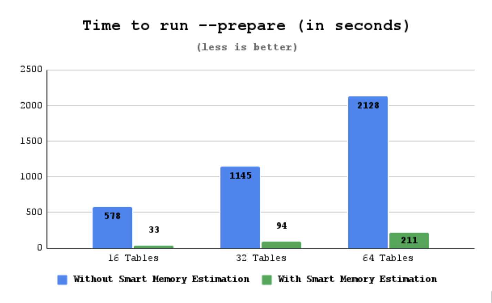

# Smart memory estimation

The Smart memory estimation is [tech preview](glossary.md#tech-preview) feature. Before using Smart memory estimation in production, we recommend that you test restoring production from physical backups in your environment and also use the alternative backup method for redundancy.

Percona XtraBackup supports the Smart memory estimation feature. With this feature, Percona XtraBackup computes the memory required for `prepare` phase, while copying redo log entries during the `backup` phase. Percona XtraBackup also considers the number of InnoDB pages to be fetched from the disk.  

Percona XtraBackup performs the backup procedure in two steps: 

* Creates a backup

    To create a backup, Percona XtraBackup copies your InnoDB data files. While copying the files, Percona XtraBackup runs a background process that watches the InnoDB redo log, also called the transaction log, and copies changes from it. 

* Prepares a backup

    During the `prepare` phase, Percona XtraBackup performs crash recovery against the copied data files using the copied transaction log file. Percona XtraBackup reads all the redo log entries into memory, categorizes them by space id and page id, reads the relevant pages into memory, and checks the log sequence number (LSN) on the page and on the redo log record. If the redo log LSN is more recent than the page LSN, Percona XtraBackup applies the redo log changes to the page.

    To `prepare` a backup, Percona Xtrabackup uses InnoDB Buffer Pool memory. Percona Xtrabackup reserves memory to load 256 pages into the buffer pool. The remaining memory is used for hashing/categorizing the redo log entries.

    The available memory is controlled by the `--use-memory` option. If the available memory on the buffer pool is insufficient, the work is performed in multiple batches. After the batch is processed, the memory is freed to release space for the next batch. This process greatly impacts performance as an InnoDB page holds data from multiple rows. If a change on a page happens in different batches, that page is fetched and evicted numerous times.

## How does Smart memory estimation work

To run `prepare`, Percona XtraBackup checks the server's available free memory and uses that memory up to the limit specified in the [`--use-free-memory-pct`](xtrabackup-option-reference.md#use-free-memory-pct) option. Due to backward compatibility, the default value for the `--use-free-memory-pct` option is 0 (zero), which defines the option as disabled. For example, if you set `--use-free-memory-pct=50`, then 50% of the free memory is used to `prepare` a backup.

You can enable or disable the memory estimation during the `backup` phase with the [`--estimate-memory`](xtrabackup-option-reference.md#estimate-memory) option. The default value is `OFF`. Enable the memory estimation with  `--estimate-memory=ON`:

```{.bash data-prompt="$"}
$ xtrabackup --backup --estimate-memory=ON --target-dir=/data/backups/
```

In the `prepare` phase, enable the [`--use-free-memory-pct`](xtrabackup-option-reference.md#use-free-memory-pct) option by specifying the percentage of free memory to be used to `prepare` a backup. The `--use-free-memory-pct` value must be larger than 0.

For example:

```{.bash data-prompt="$"}
$ xtrabackup --prepare --use-free-memory-pct=50 --target-dir=/data/backups/
```

## Example of Smart memory estimation usage

The examples of how Smart memory estimation can improve the time spent on `prepare` in Percona XtraBackup:

We back up 16, 32, and 64 tables using sysbench. Each set contains 1M rows. In the `backup` phase, we enable Smart memory estimation with `--estimate-memory=ON`. In the `prepare` phase, we set `--use-free-memory-pct=50`, and Percona XtraBackup uses 50% of the free memory to prepare a backup. The backup is run on an ec2 c4.8xlarge instance (36 vCPUs / 60GB memory / General Purpose SSD (gp2)). 

During each `--backup`, the following sysbench is run:

```text
sysbench --db-driver=mysql --db-ps-mode=disable --mysql-user=sysbench --mysql-password=sysbench --table_size=1000000 --tables=${NUM_OF_TABLES} --threads=24 --time=0 --report-interval=1 /usr/share/sysbench/oltp_write_only.lua run
```

The following table shows the backup details (all measurements are in Gigabytes):

||Used memory |Size of XtraBackup log |Size of backup|
|---|---|---|---|
| 16 tables | 3.375 | 0.7 | 4.7 |
| 32 tables | 8.625 | 2.6 | 11 |
| 64 tables | 18.5 | 5.6 | 22 |

* Used memory - the amount of memory required by Percona XtraBackup with `--use-free-memory-pct=50`

* Size of XtraBackup log - the size of Percona XtraBackup log file (redo log entries copied during the backup)

* Size of backup - the size of the resulting backup folder

`Prepare` executed without Smart memory estimation uses the default of 128MB for the buffer pool.

The results are the following:

!!! note

    The following results are based on tests in a specific environment. Your results may vary.



* 16 tables result - prepare time dropped to ~5.7% of the original time. An improvement in recovery time of about 17x.

* 32 tables result - prepare time dropped to ~8,2% of the original time. An improvement in recovery time of about 12x.

* 64 tables result - prepare time dropped to ~9.9% of the original time. An improvement in recovery time of about 10x.
