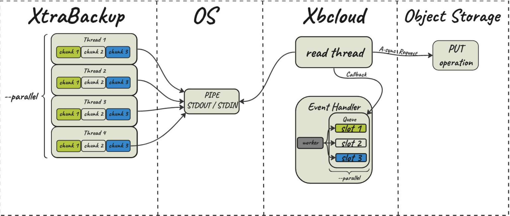
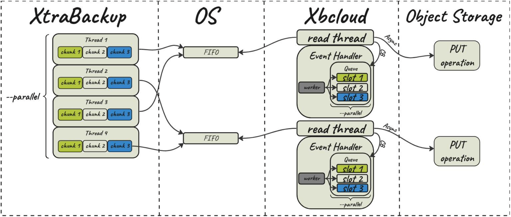

# FIFO data sink

The feature is in [tech preview](glossary.md#tech-preview).

Percona XtraBackup implements a data sink that uses the first in, first out (FIFO) method. With the `FIFO` data sink feature, users with a streaming capacity of 10Gbps (typically on a Local Area Network (LAN)) can benefit from faster backups by streaming data in parallel to an object storage.

## FIFO data sink options

Percona XtraBackup implements the following options:

* `--fifo-streams=#` - specifies the number of FIFO files to use for parallel data stream. To disable FIFO data sink and send stream to STDOUT, set `--fifo-streams=1`. The default value is `1` (STDOUT) to ensure the backward compatibility. The `--fifo-streams` value must match on both the XtraBackup and xbcloud sides.
* `--fifo-dir=name` - specifies a directory to write Named Pipe.
* `--fifo-timeout=#` - specifies the number of seconds to wait for the other end to open the stream for reading. The default value is `60` seconds.

## How to enable FIFO data sink

To use FIFO data sink, you can either run two commands in separate terminal sessions or run xtrabackup in the background.

For example, run the following commands in separate terminal sessions:

```{.bash data-prompt="$"}
$ xtrabackup --backup --stream --fifo-streams=2 --fifo-dir=/tmp/fifo
```

```{.bash data-prompt="$"}
$ xbcloud put --fifo-streams=2 --fifo-dir=/tmp/fifo full
```

Run xtrabackup in the background with the following commands:

```{.bash data-prompt="$"}
$ xtrabackup --backup --stream --fifo-streams=2 --fifo-dir=/tmp/fifo &
$ xbcloud put --fifo-streams=2 --fifo-dir=/tmp/fifo full
```

## Stream to an object storage

When taking a backup, you can save the files locally or stream the files to either a different server or an object storage. 

<!---
Before [Percona XtraBackup 8.0.33-28](release-notes/8.0/8.0.33-28.0.md), XtraBackup streams data to an object storage writing to STDOUT (a pipe) and using [`xbcloud`](xbcloud-binary-overview.md) to read from STDIN (standard input device). 

XtraBackup spawns multiple copy threads and each copy thread reads a data chunk from a specific file. Then each copy thread writes the data chunks to a pipe (STDOUT). An xbcloud read thread reads each chunk of STDIN data. Then xbcloud uploads the chunks to an object storage using an async request, and adds a callback to an event handler list. The xbcloud event handler executes the callback depending on the response from the object storage (success or failure).



The streaming capacity for XtraBackup using STDOUT is 1.8G. This capacity is sufficient for streaming data using Wide Area Network (WAN) into, for example, Amazon Web Services or Google Cloud Platform. 

--->

When you stream backups to Amazon S3 compatible storage using LAN with a streaming capacity of 10Gbps, XtraBackup can use multiple FIFO streams to stream the backups faster. 

XtraBackup spawns multiple copy threads and each copy thread reads a data chunk from a specific file. Then multiple FIFO files are created to store the data from XtraBackup. Each XtraBackup copy thread writes the data chunks to a specific FIFO file. Xbcloud reads from the FIFO streams and uploads data to an object storage using an async request. The xbcloud event handler executes the callback depending on the response from the object storage (success or failure). 



## Performance improvement 

Consider an example of using a FIFO data sink compared to the STDOUT method.

The database has 1TB of data in multiple tables. The link speed between the source server and destination server using MinIO is ~ 9.2 Gbps.

Both STDOUT and FIFO data sink scenarios push 1TB of data from two servers.

For the FIFO data sink we configure 8 parallel streams with `--fifo-streams=8` both for XtraBackup and xbcloud.

The results are the following:

* The `STDOUT` method takes 01:25:24 to push 1TB of data using 239 MBps (1.8 Gbps).
* The `FIFO` method, using 8 streams, takes 00:16:01 to push 1TB of data using 1.15 GBps (9.2 Gbps).


